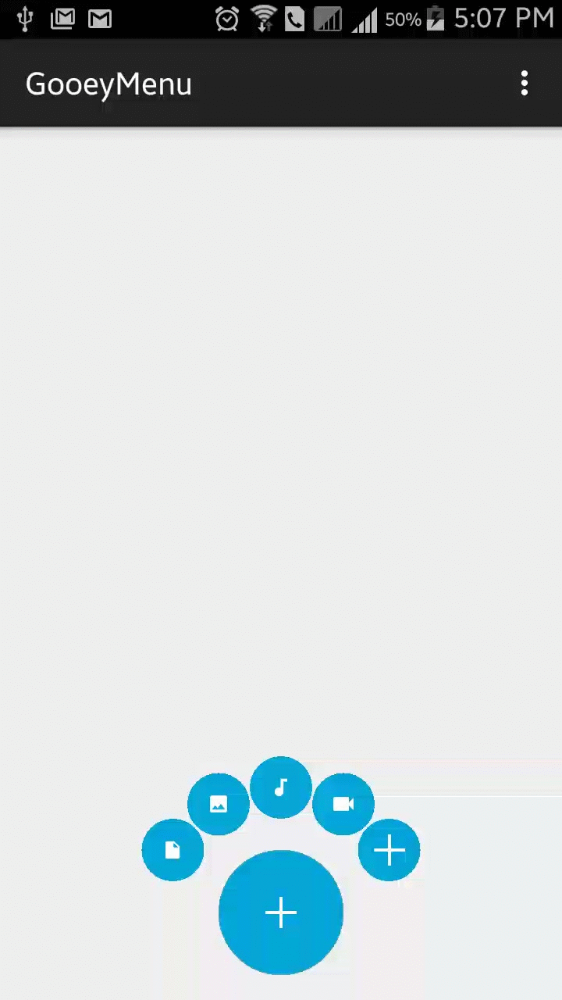

Option menu with gooey effectes.

Inspired by this [dribbble](https://dribbble.com/shots/1936758-GIF-of-the-Tap-Bar-Concept):

### What this Lib cab do :

**1.Tab on each menu you get call with menu number.**

**2.You can customize the number of the menu.**

**3.Distance between super menu and sub men can be customize.**

**4.Customize menu icon.**

also,you can set the menu's icon:
